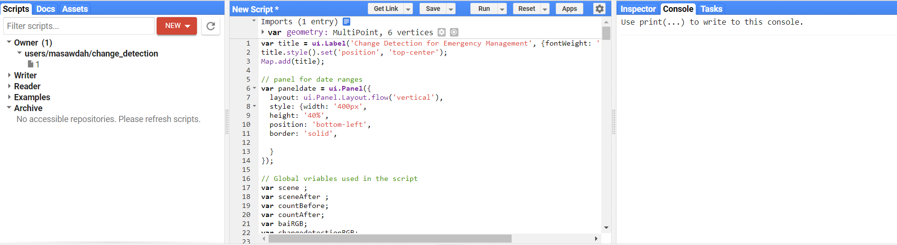

## The App's Code

Google Engine provides a [full tutorial](https://developers.google.com/earth-engine/tutorials) including a guide and documentation describing all of the functions and algorithms you can use to modify the code and improve the functionality. The following steps describe how you can use the code in the Google Earth Engine code editor: 

* Download the code from [GitHub](code.js).

* Create an account on [Google Earth Engine for Developer](https://earthengine.google.com/).

* Go to [Earth Engine Code Editor](https://code.earthengine.google.com/) .

* Copy the code and past it on the code editor space. 

* Click the Run button to run the script and check if it is working.

* Click the save button to save the code on your account so you can use it every time without repeat the previous steps.

The following figure shows the google earth engine platform that the user can use to test, rebuild and modify the code.

*Fig. 1 - The Earth Engine Code Editor*

[Go Back](README.md)
