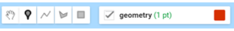
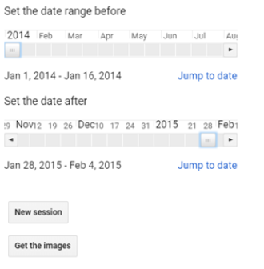
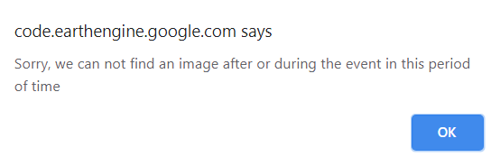
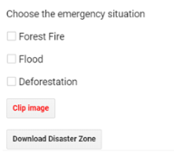
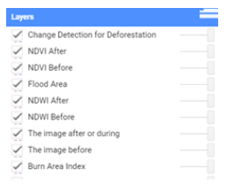
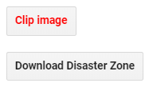

## User Manual 
Navigate to the study area using the bookmarks, then follow the following steps:

1- The user is required to set the location of the area using points, lines, or polygons. 

*Fig. 1 - Draw tools*

2- Select the dates before and after the event. Then, click on the "Get the Images" button to tell GEE to find the appropriate images on the selected dates.

*Fig. 2 - Date Slider*

* In case images are not available in the database, the alert message will pop-up to tell the user to change the date. 

*Fig. 3 - Warning Message*

4- select the type of emergency: deforestation, flood, or forest fires.

*Fig. 4 - Emergency Options*

*The user can select the map layers that appear in the study area.

*Fig. 5 - Selected Layers*

5- Cut the affected area, then download it, use it locally.

*Fig. 6 - Clip & Download the results*

[Go Back](README.md)
